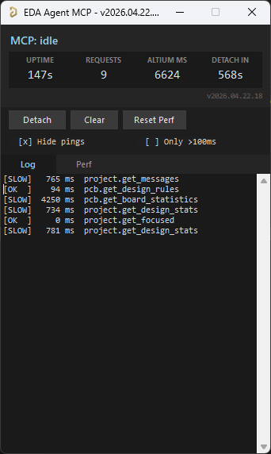

# eda-agent

MCP server that lets an AI (or any MCP-compatible client) **interact with a live Altium Designer session**. It exposes 140+ tools covering schematic, PCB, library, and project operations over a persistent DelphiScript bridge — the AI reads the design you currently have open, asks questions about it, and can modify it in place while you watch.

> **⚠️ Experimental.** Not all tools are extensively tested. Some can crash the Altium DelphiScript engine. See [Known limitations](#known-limitations) before using on any design you haven't backed up.

## Demo

Claude Code reviewing a buck converter through eda-agent. The feedback resistor divider on this schematic is intentionally wrong — Claude catches it among other recommendations.

[](https://youtu.be/snRyCx3OlxM)

## Dashboard



A floating Altium-side window shows live status, request count, cumulative Altium-side time, auto-shutdown countdown, and a per-command log with durations. `Hide pings` filters the 30 s keep-alive traffic; `Only >100ms` isolates slow calls. The **Detach** button saves all dirty docs and exits the polling loop cleanly.

## How it works

- Altium Designer stays open and in full control of your design
- A DelphiScript polling loop runs inside Altium's scripting engine
- `eda-agent` (Python, launched by your MCP client) sends commands via file-based IPC
- Altium executes, writes a response, and returns to polling
- You see the changes happen live in Altium

This is **not** a batch tool that opens a project, runs a script, and exits. It's a live connection for as long as you want it — conversational design review, guided refactoring, ad-hoc BOM queries, "what nets does this resistor connect to?" — all on the project you currently have open.

## Features

- **140+ tools** across application, project, library, generic, and PCB categories
- **Generic primitives** (`query_objects`, `modify_objects`, `create_object`, `delete_objects`, `run_process`) that work on almost any schematic or PCB object type via late-binding — avoids per-type handler proliferation
- **Persistent polling loop** — one script start, then ~10 ms per tool call in active mode
- **Batched routing** — `pcb_place_tracks` takes a list of segments and places them all in one IPC round-trip; routing a whole net is the same wall time as placing a single track
- **Annotation runs silently** — `annotate` designates components without popping the annotate dialog
- **Deferred save for speed** — mutations mark documents as modified in memory; disk writes happen on explicit `save_all` (or automatically on `detach_from_altium`). Before this, every edit triggered a full project save, which dominated latency
- **Live dashboard** — a floating Altium-side window shows status, request count, per-command performance stats, and a command log. Detach button exits the loop cleanly; `Hide pings` / `Only >100ms` checkboxes filter noise
- **Activity logs** — every command is appended to `workspace/activity.log` (CSV with timestamps, durations, command name, response size). The bridge also writes `bridge_trace.log` for IPC-level diagnostics
- **pip-installable** — no admin, no installer, no touching Altium's config

## Requirements

- Windows (Altium Designer is Windows-only)
- Python 3.11+
- Altium Designer (recent versions, AD20+ preferred)

## Installation

```bash
git clone https://github.com/salitronic/eda-agent
cd eda-agent
pip install -e .
```

Register the server with your MCP client. The binary is `eda-agent` and runs on stdio — consult your client's docs for how to add a local stdio-based server.

### Claude Code

```bash
claude mcp add altium eda-agent
```

Adds `eda-agent` as an MCP server named `altium` to your Claude Code project config. Use `-s user` to register it at the user level (available across every project):

```bash
claude mcp add -s user altium eda-agent
```

If `eda-agent` isn't on your `PATH`, give the full path instead — pip reports it after install, typically `%USERPROFILE%\AppData\Roaming\Python\Python312\Scripts\eda-agent.exe` on Windows. To verify the connection: `/mcp` in a Claude Code session should list `altium` as connected.

### Other MCP clients

The server speaks standard MCP over stdio; any client that accepts a local stdio command will work. Invoke `eda-agent` (or `eda-agent serve`) as the subprocess.

### Altium-side scripts

Drop the Altium script project somewhere you can find it:

```bash
eda-agent install-scripts
```

Default destination: `%USERPROFILE%\EDA Agent\scripts\`. Use `--dest PATH` to put it elsewhere.

Register the script as a Global Project in Altium (once):

1. **DXP → Preferences → Scripting System → Global Projects** → **Install from file**
2. Select the `Altium_API.PrjScr` you just installed

From then on, every Altium startup compiles the script project and the polling loop is one click away:

1. **File → Run Script...**
2. Expand `Altium_API` → `Dispatcher.pas`, select **StartMCPServer**, click **Run**

The polling loop starts and your MCP client can drive Altium.

> If you'd rather not register the script globally, you can also open `Altium_API.PrjScr` via **File → Open...** and launch `StartMCPServer` from the **Run Script...** dialog the same way — the dialog picks up any loaded script project.

## Example use cases

### Schematic review

The AI reads your schematic live. Ask it anything a reviewer would:

> *"List every component connected to the 3V3 rail and flag anything whose datasheet limit is below that."*
>
> *"Find all net labels that appear only once across the whole project — those are probably typos."*
>
> *"What's driving the /RESET net? Walk the connectivity and tell me where it resets and how."*
>
> *"Do any two components share a designator prefix with gaps in numbering (e.g. R1, R2, R4)? Re-annotate or tell me what's missing."*
>
> *"Compare the focused schematic to the version from 3 weeks ago — what parameter values changed?"*

Under the hood, the AI calls tools like `query_objects(object_type="eSchComponent", scope="project")`, `get_connectivity(designator=...)`, `get_nets(...)`, `modify_objects(...)`, and so on. You watch Altium repaint as it works.

### Library hygiene

> *"Open `Resistors.SchLib` and report every component missing a Value, ManufacturerPart1, or Description parameter. Fill in the missing Description from the datasheet URL if present."*
>
> *"Diff our `Caps.SchLib` against `Caps_vendor.SchLib` and tell me what's new or changed."*

### PCB spot-checks

> *"Any unrouted nets on the board?"*
>
> *"What's the total trace length for the USB differential pair, split by layer?"*
>
> *"Show me all vias on the 12V net and their drill sizes."*
>
> *"Run DRC and summarize the violations by severity."*

### Bulk changes

> *"Every 0402 resistor with value 10k, set its Tolerance parameter to 1% and Voltage to 50V."*
>
> *"Rename the net OLD_CS to SPI_CS across every sheet in the project."*

## Known limitations

**This tool is experimental. Please read this section before using on a design you haven't backed up.**

### Altium DelphiScript engine can crash

Some tool paths trigger DelphiScript compile or runtime errors ("Undeclared identifier…", "Could not convert variant of type (Dispatch) into type (OleStr)", etc.). When that happens, the script project halts mid-execution and the polling loop stops responding. You will see one of:

- An Altium error dialog stating the problem
- Your MCP client timing out waiting for a response

**Recovery:** in Altium Designer, open the script project tab, press the **red Stop** button in the Script IDE toolbar (or press **Ctrl+F2**). This stops the halted debugger. Then re-launch the polling loop via **File → Run Script... → StartMCPServer → Run**.

This is an ongoing reliability effort. Every identified crash is either fixed or guarded. If you hit a new one, the Altium error dialog tells you the exact identifier or line — opening an issue with that text helps us harden the relevant path.

### Altium tool buttons relying on internal scripting pause while the server is running

Altium itself uses DelphiScript internally for many built-in commands (some ribbon buttons, panel actions, menu items). **While the `eda-agent` polling loop is active, those built-in commands may become temporarily unresponsive** because Altium's scripting engine is single-threaded and currently owned by our polling loop.

**The polling loop owns the scripting engine for as long as it's running.** While it runs, Altium's own script-backed buttons sit waiting. The loop exits when either:

- The MCP client calls `detach_from_altium` (or the dashboard **Detach** button is clicked) — loop saves all dirty docs, exits within ~500 ms, and Altium becomes fully responsive, OR
- **10 minutes of total silence** from the MCP client (no commands AND no keep-alive pings) triggers the built-in auto-shutdown

In practice, while an MCP client is attached and sending keep-alive pings every 30 s, the loop will never time out on its own — you need to either have the AI call `detach_from_altium` or close the MCP client session entirely. After the client disconnects, expect up to ~10 minutes for the loop to auto-exit unless you use **Detach** to release it immediately.

### ECO (sch → PCB update) is not reliably scriptable

`update_pcb` wraps `RunProcess('PCB:UpdatePCBFromProject')`. On some Altium builds this runs silently without applying changes; on others it pops the modal ECO dialog. The Altium Schematic API doesn't expose a fully scripted ECO executor — `IECO` only records proposed changes, no `DM_Execute` method is documented, and no factory is exposed for obtaining an `IECO` instance from a script.

**Practical workflow:** call `update_pcb` and check the result's `components_added_to_pcb` count. If it's zero while `in_sync` is `false`, open the PCB in Altium and run **Design → Import Changes From …** yourself. Once the dialog is dismissed, every other tool (`pcb_move_component`, `pcb_place_track`, `pcb_run_drc`, etc.) works normally.

### Tools vary in maturity

Not every one of the 140+ tools has been exercised on every Altium version or design size. The [generic primitives](#generic-primitives) and the core `application` / `project` tools are the best-tested. Some PCB modify operations (polygon repour, room creation, align-components) are less battle-tested. Queries are generally safer than mutations.

## Timeout and server lifecycle

The server has **three independent timeout mechanisms**:

### 1. Per-command timeout (Python side)

When the MCP client calls a tool, the Python bridge writes a request file and waits up to **10 seconds by default** for a response. Fast queries typically complete in under 100 ms, so a 10 s ceiling surfaces stalls quickly while leaving plenty of margin for real work. Long-running tools that are expected to take longer (`save_all`, `stop_server`, `pcb_get_unrouted_nets`) set their own larger timeouts internally.

Concurrent calls from the MCP client and the keep-alive thread are serialized by a `threading.Lock` in the bridge so their responses never race on the single `response.json` channel.

### 2. Server auto-shutdown (Altium side)

The DelphiScript polling loop auto-stops after **10 minutes of inactivity** (`AUTO_SHUTDOWN_MS = 600000`). If the MCP client disconnects and the keep-alive pings stop arriving, the server releases Altium's scripting engine after ten minutes and `StartMCPServer` returns. To resume, re-launch via **File → Run Script... → StartMCPServer → Run**.

### 3. Python keep-alive pings

While an MCP client is attached, the Python bridge pings Altium every 30 seconds so the 10-minute auto-shutdown never fires mid-session. The sequence:

- **AI issues command A** → Altium busy, then idle
- **30 s later, Python pings** → Altium responds "pong", idle timer resets
- **10 min later, still no AI activity and no ping** → Altium auto-shuts down

In practice: the server stays alive as long as an MCP client is connected, and exits cleanly ~10 minutes after the client fully disconnects. No manual stop needed in the common case. For a hard exit, the AI (or the **Detach** button on the dashboard window) calls `detach_from_altium`, which persists any unsaved work via `save_all` and returns control to Altium within ~500 ms.

### Why this matters for Altium UI responsiveness

The polling loop goes into idle mode after ~1 second of no MCP commands. In idle mode it polls every 100 ms with a `ProcessMessages` yield in between, so Altium's UI stays responsive continuously. In active mode the loop polls every 10 ms (`ProcessMessages` every 5th tick), giving sub-50 ms round-trip latency for back-to-back commands. For a full release, call `detach_from_altium` or click **Detach** on the dashboard.

## Tool reference

140+ tools grouped into five categories. The **generic primitives** are the engine; the rest are convenience wrappers or category-specific operations.

### Generic primitives (the core)

These five tools cover most day-to-day work. They accept any object type supported by the bridge.

| Tool | Purpose |
|---|---|
| `query_objects` | Read properties from schematic or PCB objects, with filter and scope |
| `modify_objects` | Set properties on matching objects |
| `create_object` | Create and place a new object |
| `delete_objects` | Delete matching objects |
| `batch_modify` | Apply many modify operations in one IPC round trip |
| `generic_run_process` | Execute any Altium process command with keyed parameters |

**Supported schematic object types:** `eNetLabel`, `ePort`, `ePowerObject`, `eSchComponent`, `eWire`, `eBus`, `eBusEntry`, `eParameter`, `ePin`, `eLabel`, `eLine`, `eRectangle`, `eSheetSymbol`, `eSheetEntry`, `eNoERC`, `eJunction`, `eImage`.

**Supported PCB object types:** `eTrackObject`, `eViaObject`, `ePadObject`, `eComponentObject`, `eArcObject`, `eFillObject`, `eTextObject`, `ePolyObject`, `eRuleObject`, plus selection and design-rule classes.

**Scope values:** `active_doc`, `project`, `project:<path>`, `doc:<path>`.

### Application (13 tools)

| Tool | Purpose |
|---|---|
| `get_altium_status` | Is Altium running? Version / PID / attached state |
| `attach_to_altium` | Verify connection to the running instance |
| `detach_from_altium` | Save all dirty docs, signal server shutdown, release scripting engine |
| `save_all` | Flush every modified document to disk (explicit checkpoint for the deferred-save model) |
| `ping_altium` | Test the polling loop is responsive; reports script version + mismatch with bundled |
| `get_open_documents` | List every open document with `loaded` flag (sch, pcb, lib, outjob…) |
| `get_active_document` | Which document currently has focus |
| `set_active_document` | Switch focus to an already-loaded document by path |
| `create_document` | Create a blank PCB / SCH / library / OutJob document and attach to the focused project |
| `get_altium_version` | Build / product version string |
| `get_preferences` | Snap grids, unit system, common prefs |
| `execute_menu` | Run a menu command by path (e.g., `Tools|Design Rule Check`) |
| `get_clipboard_text` | Read text from Windows clipboard |

### Project (43 tools)

Lifecycle, parameters, compilation, analysis, outputs, ECO sync, variants.

| Tool | Purpose |
|---|---|
| `create_project` / `open_project` / `save_project` / `close_project` | Project lifecycle |
| `save_all` / `get_focused_project` / `get_open_projects` / `get_project_path` | Project state |
| `get_project_documents` / `add_document_to_project` / `remove_document_from_project` / `import_document` | Document management |
| `load_project_sheets` | Force every SCH sheet of the focused project into the editor so `scope=project` queries hit them |
| `get_project_parameters` / `set_project_parameter` / `set_document_parameter` | Parameters |
| `get_project_options` | Compiler / variant / channel settings |
| `compile_project` / `get_messages` | Compile and read violations |
| `get_design_stats` / `get_design_differences` / `get_board_info` | Design analysis |
| `get_bom` / `get_nets` / `get_component_info` / `get_connectivity` / `find_component` | Design queries |
| `cross_probe` / `lock_designator` / `annotate` | Designator management |
| `compare_sch_pcb` / `update_pcb` / `update_schematic` | ECO sync (see [ECO limitation](#eco-sch--pcb-update-is-not-reliably-scriptable)) |
| `get_variants` / `get_active_variant` / `set_active_variant` / `create_variant` | Variant management |
| `export_pdf` / `export_step` / `export_dxf` / `export_image` / `generate_output` | Output generation |
| `get_outjob_containers` / `run_outjob` | OutJob execution |

### Library (21 tools)

Symbol and footprint creation, linking, batch editing, comparison.

| Tool | Purpose |
|---|---|
| `lib_create_symbol` / `lib_copy_component` / `lib_set_component_description` | Symbol lifecycle |
| `lib_add_pin` / `lib_get_pin_list` | Pins |
| `lib_add_symbol_rectangle` / `lib_add_symbol_line` / `lib_add_symbol_arc` / `lib_add_symbol_polygon` | Symbol graphics |
| `lib_create_footprint` | Footprint creation |
| `lib_add_footprint_pad` / `lib_add_footprint_track` / `lib_add_footprint_arc` | Footprint primitives |
| `lib_link_footprint` / `lib_link_3d_model` | Link footprint / 3D model to symbol |
| `lib_get_components` / `lib_get_component_details` / `lib_search` | Browse and search |
| `lib_batch_set_params` / `lib_batch_rename` | Bulk parameter / rename operations |
| `lib_diff_libraries` | Compare two libraries |

### Schematic and general (28 tools)

Schematic-side operations plus viewport and sheet management.

| Tool | Purpose |
|---|---|
| `query_objects` / `modify_objects` / `create_object` / `delete_objects` / `batch_modify` | Generic primitives (see above) |
| `select_objects` / `deselect_all` | Selection state |
| `zoom` / `switch_view` / `refresh_document` | Viewport |
| `highlight_net` / `clear_highlights` | Net highlighting |
| `run_erc` / `get_unconnected_pins` | Electrical rules check |
| `add_sheet` / `delete_sheet` / `get_sheet_parameters` / `get_document_info` | Sheet management |
| `place_wire` / `place_bus` / `place_net_label` / `place_port` / `place_power_port` | Schematic placement |
| `place_sheet_symbol` / `place_sheet_entry` / `place_bus_entry` | Hierarchical sheet primitives |
| `place_sch_component_from_library` | Instantiate a component from an SchLib at (x,y) with rotation and designator override |
| `sch_set_sheet_size` | Change SheetStyle (A / A0–A4 / Letter / Legal / Custom) |
| `place_no_erc` / `place_junction` / `place_image` / `place_note` / `place_directive` | Markers, annotations, directives |
| `place_rectangle` / `place_line` | Graphical primitives |
| `copy_objects` / `get_object_count` / `replace_component` | Bulk operations |
| `set_grid` | Change snap / visible grid |
| `get_font_spec` / `get_font_id` | Font table lookup |
| `generic_run_process` | Run any Altium process command |

### PCB (37 tools)

Queries and modifications on the active PCB document.

| Tool | Purpose |
|---|---|
| `pcb_get_nets` / `pcb_get_net_classes` / `pcb_create_net_class` | Net / net class management |
| `pcb_get_design_rules` / `pcb_create_design_rule` / `pcb_delete_design_rule` / `pcb_get_diff_pair_rules` / `pcb_get_room_rules` | Design rules |
| `pcb_run_drc` | Run design rule check, return violations |
| `pcb_get_components` / `pcb_move_component` / `pcb_flip_component` / `pcb_align_components` / `pcb_snap_to_grid` | Component placement |
| `pcb_get_component_pads` / `pcb_get_pad_properties` | Pad inspection |
| `pcb_place_track` / `pcb_place_tracks` / `pcb_set_track_width` / `pcb_get_trace_lengths` | Track operations (batch variant for whole-net routing) |
| `pcb_place_via` / `pcb_place_via_array` / `pcb_get_vias` | Via operations and stitching arrays |
| `pcb_place_arc` / `pcb_place_text` / `pcb_place_fill` / `pcb_place_pad` | Primitive placement |
| `pcb_place_dimension` / `pcb_place_angular_dimension` / `pcb_place_radial_dimension` | Dimension annotations |
| `pcb_start_polygon_placement` / `pcb_place_polygon_rect` / `pcb_place_region` / `pcb_get_polygons` / `pcb_modify_polygon` / `pcb_repour_polygons` | Polygons and regions |
| `pcb_create_diff_pair` / `pcb_distribute_components` / `pcb_set_board_shape` | Higher-level ops |
| `pcb_create_room` | Room placement |
| `pcb_get_unrouted_nets` | Ratsnest / unrouted analysis |
| `pcb_get_layer_stackup` / `pcb_set_layer_visibility` | Layer stack |
| `pcb_get_board_outline` / `pcb_get_board_statistics` | Board-level queries |
| `pcb_get_selected_objects` | Current selection |
| `pcb_export_coordinates` | Pick-and-place export |
| `pcb_delete_object` | Delete a specific object |

## Architecture

```
    +-----------------------------+
    |    MCP-compatible client    |
    +-----------------------------+
                  |
                  |  MCP (stdio)
                  v
    +-----------------------------+
    |     eda-agent (Python)      |
    |   application / project /   |
    |   library / generic / pcb   |
    |              |              |
    |     Altium bridge (IPC)     |
    +-----------------------------+
                  |
                  |  request.json / response.json
                  v
    +-----------------------------+
    |      Altium Designer        |
    |  DelphiScript polling loop  |
    |     (Altium_API.PrjScr)     |
    +-----------------------------+
```

All intelligence lives in Python. The DelphiScript side is a pass-through layer for object iteration, property access, and process execution.

## CLI

| Command | Purpose |
|---|---|
| `eda-agent` | Start the MCP server on stdio (what the MCP client calls) |
| `eda-agent serve` | Explicit form of the above |
| `eda-agent scripts-path` | Print path to bundled DelphiScript sources |
| `eda-agent install-scripts [--dest PATH] [--force]` | Copy scripts to a directory of your choice |

## Configuration

Workspace (used for IPC files between Python and Altium):

- Default: `%USERPROFILE%\EDA Agent\workspace\`
- Override: set `EDA_AGENT_WORKSPACE` environment variable
- The DelphiScript side reads the resolved path from `C:\ProgramData\eda-agent\workspace-path.txt`, which Python writes at startup and on every `install-scripts` run

Coordinates throughout the API are in **mils** (1 mil = 0.0254 mm).

## Development

```bash
pip install -e ".[dev]"
python -m pytest tests/ -q
```

The test suite includes a Python Altium simulator for end-to-end integration tests, Free Pascal cross-validation that runs the actual DelphiScript functions against Python mirrors, and a regression suite for previously encountered edge cases.

Rebuild the monolithic DelphiScript file after editing sources under `scripts/altium/`:

```bash
cd scripts/altium
python build.py
```

## Project layout

```
eda-agent/
├── src/eda_agent/          Python package
│   ├── bridge/             Altium communication layer
│   ├── tools/              MCP tool implementations
│   ├── cli.py              CLI subcommands
│   └── server.py           MCP server entry point
├── scripts/altium/         DelphiScript sources (dev source of truth)
│   ├── Main.pas, Utils.pas, Dispatcher.pas, …
│   └── Altium_API.PrjScr   Altium script project
└── tests/                  Python + Free Pascal test suite
```

At wheel build time `scripts/altium/` is copied into `src/eda_agent/scripts/` inside the wheel (via Hatchling `force-include`), so `eda-agent install-scripts` always finds the scripts.

## Troubleshooting

**"Altium Designer is not running"** — open Altium before invoking MCP tools.

**"Script not responding" / MCP tools time out** — confirm the script project is loaded and `StartMCPServer` is running. Re-launch it via **File → Run Script... → StartMCPServer → Run**. Check `%USERPROFILE%\EDA Agent\workspace\` is writable.

**Altium error dialog "Undeclared identifier: …" or "Could not convert variant…"** — a DelphiScript crash in one of the bridge handlers. In Altium's Script IDE toolbar, press the red **Stop** button (or `Ctrl+F2`) to halt the debugger. Then re-launch the polling loop via **File → Run Script... → StartMCPServer → Run**. Report the identifier or error text as an issue.

**Some Altium buttons don't respond while the server is running** — expected while the AI is actively issuing commands. Built-in Altium functions that depend on DelphiScript wait for the polling loop to yield. The loop enters an idle/yield mode within ~1 s of the last AI command; if a button is still unresponsive after that, call `detach_from_altium` from the MCP client to fully release the scripting engine.

**Command timeouts on very large boards** — default is 10 s so stalls surface fast. Tools known to take longer (`save_all`, `pcb_get_unrouted_nets`, `stop_server`) set their own internal timeouts up to 60 s. If you hit a timeout on a custom long-running operation, embed the bridge directly and pass a higher `timeout=` to `send_command_async`. The polling loop itself adapts (10 ms active, 100 ms idle) so it doesn't add latency.

## License

Apache License 2.0. See [LICENSE](LICENSE) and [NOTICE](NOTICE).

## Disclaimer

**Use at your own risk.** `eda-agent` drives Altium Designer programmatically and can modify, save, or delete design data. An AI client operating it can issue rapid, irreversible changes. Before using this tool on any design:

- **Back up your project.** Commit to version control, copy the folder elsewhere, or both. Do not rely solely on Altium's own history.
- Expect the possibility of **data loss, corrupted documents, or Altium crashes** — especially on large boards, unusual object configurations, or untested API paths.
- Review automated changes before saving. Prefer working on a branch or a copy until you have trust in a given workflow.

This software is provided "as is", without warranty of any kind, express or implied. The authors and contributors are not liable for any damage to your designs, projects, data, or installation.

This project is not affiliated with, endorsed by, or sponsored by Altium Limited. "Altium" and "Altium Designer" are trademarks of Altium Limited. `eda-agent` is an independent community tool that interoperates with Altium Designer via its published scripting API.
